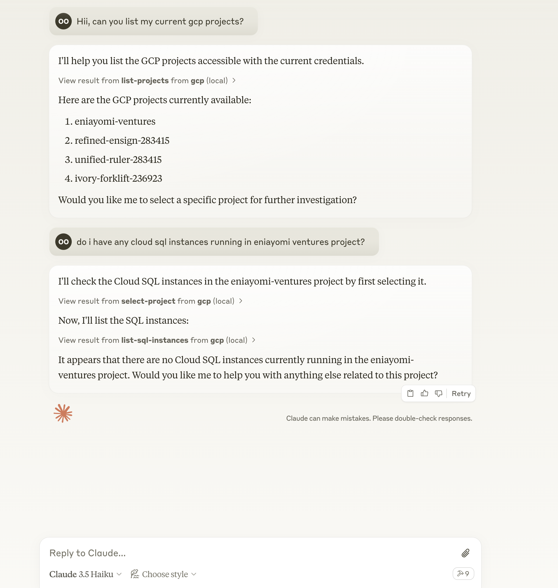

# GCP MCP

A Model Context Protocol (MCP) server that enables AI assistants like Claude to interact with your Google Cloud Platform environment. This allows for natural language querying and management of your GCP resources during conversations.



## Features

* 🔍 Query and modify GCP resources using natural language
* ☁️ Support for multiple GCP projects
* 🌐 Multi-region support
* 🔐 Secure credential handling (no credentials are exposed to external services)
* 🏃‍♂️ Local execution with your GCP credentials
* 🔄 Automatic retries for improved reliability

## Prerequisites

* Node.js
* Claude Desktop/Cursor/Windsurf
* GCP credentials configured locally (application default credentials)

## Installation

1. Clone the repository:
```bash
git clone https://github.com/eniayomi/gcp-mcp
cd gcp-mcp
```

2. Install dependencies:
```bash
npm install
```

## Configuration

### Claude Desktop

1. Open Claude desktop app and go to Settings -> Developer -> Edit Config

2. Add the following entry to your `claude_desktop_config.json`:

via npm:
```json
{
  "mcpServers": {
    "gcp": {
      "command": "sh",
      "args": ["-c", "npx -y gcp-mcp"]
    }
  }
}
```

If you installed from source:
```json
{
  "mcpServers": {
    "gcp": {
      "command": "npm",
      "args": [
        "--silent",
        "--prefix",
        "/path/to/gcp-mcp",
        "start"
      ]
    }
  }
}
```

Replace `/path/to/gcp-mcp` with the actual path to your project directory if using source installation.

### Cursor

1. Open Cursor and go to Settings (⌘,)
2. Navigate to AI -> Model Context Protocol
3. Add a new MCP configuration:
```json
{
  "gcp": {
    "command": "npx -y gcp-mcp"
  }
}
```

### Windsurf

1. Open `~/.windsurf/config.json` (create if it doesn't exist)
2. Add the MCP configuration:
```json
{
  "mcpServers": {
    "gcp": {
      "command": "npx -y gcp-mcp"
    }
  }
}
```

### GCP Setup

1. Set up GCP credentials:
   - Set up application default credentials using `gcloud auth application-default login`

2. Refresh your AI assistant (Claude Desktop/Cursor/Windsurf)

## Usage

Start by selecting a project or asking questions like:
* "List all GCP projects I have access to"
* "Show me all Cloud SQL instances in project X"
* "What's my current billing status?"
* "Show me the logs from my Cloud Run services"
* "List all GKE clusters in us-central1"
* "Show me all Cloud Storage buckets in project X"
* "What Cloud Functions are deployed in us-central1?"
* "List all Cloud Run services"
* "Show me BigQuery datasets and tables"

## Available Tools

1. `run-gcp-code`: Execute GCP API calls using TypeScript code
2. `list-projects`: List all accessible GCP projects
3. `select-project`: Select a GCP project for subsequent operations
4. `get-billing-info`: Get billing information for the current project
5. `get-cost-forecast`: Get cost forecast for the current project
6. `get-billing-budget`: Get billing budgets for the current project
7. `list-gke-clusters`: List all GKE clusters in the current project
8. `list-sql-instances`: List all Cloud SQL instances in the current project
9. `get-logs`: Get Cloud Logging entries for the current project
10. `check-bq-table-metadata`: Get metadata for a BigQuery table.
11. `check-bq-table-schema`: Get the schema of a BigQuery table.
12. `dry-run-bq-query`: Perform a dry run of a BigQuery query to validate and estimate costs. (Note: The `projectId` argument specifies the project for job execution/billing. For cross-project queries, use fully qualified table names like `\`project-id.dataset-id.table-id\`` in your SQL.)
13. `run-bq-query`: Execute a BigQuery query and return results. (Note: The `projectId` argument specifies the project for job execution/billing. For cross-project queries, use fully qualified table names like `\`project-id.dataset-id.table-id\`` in your SQL.)

## Example Interactions

1. List available projects:
```
List all GCP projects I have access to
```

2. Select a project:
```
Use project my-project-id
```

3. Check billing status:
```
What's my current billing status?
```

4. View logs:
```
Show me the last 10 log entries from my project
```

## Supported Services

* Google Compute Engine
* Cloud Storage
* Cloud Functions
* Cloud Run
* BigQuery
* Cloud SQL
* Google Kubernetes Engine (GKE)
* Cloud Logging
* Cloud Billing
* Resource Manager
* More coming soon...

## Troubleshooting

To see logs:
```bash
tail -n 50 -f ~/Library/Logs/Claude/mcp-server-gcp.log
```

Common issues:
1. Authentication errors: Ensure you've run `gcloud auth application-default login`
2. Permission errors: Check IAM roles for your account
3. API errors: Verify that required APIs are enabled in your project
4. BigQuery Location Mismatches: Queries, especially on public or cross-project datasets, may fail if the job `location` (e.g., 'US', 'EU', 'us-central1') doesn't match the dataset's actual location. Ensure the `location` parameter in BigQuery tools is correctly set. Error messages from these tools now include a hint regarding this.

## Contributing

Contributions are welcome! Please feel free to submit a Pull Request. 

## License

MIT 